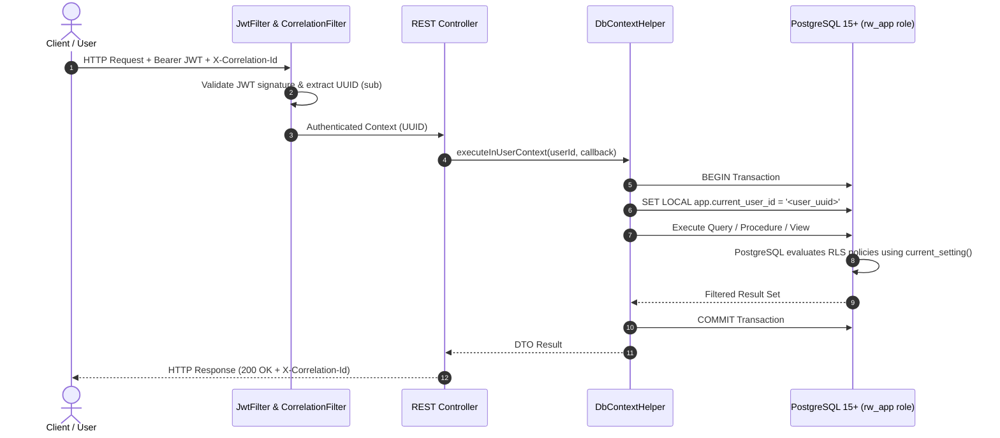

# System Architecture Documentation
**Riwi Co. S.A.S. — Internal Messaging Platform with AI Copilot**  
**Clean Architecture & Smart Database Paradigm (Decisions D-01 through D-15)**

---

## 1. High-Level Clean Architecture

The platform follows a **Clean 3-Tier Layered Architecture** with a **Smart Database** paradigm. Business rules, data integrity, authorization boundaries, and security enforcement are centralized inside PostgreSQL 15+, while the Java backend operates as a high-throughput, thin orchestration layer.

```mermaid
graph TD
    subgraph Client Tier ["Frontend Client (SPA)"]
        UI["React 18 + Tailwind CSS"]
        Z1["Zone 1: Channels & Conversations"]
        Z2["Zone 2: Chat & Keyset Pagination"]
        Z3["Zone 3: AI Copilot & Citations"]
        WSClient["STOMP / SockJS WebSocket Client"]
    end

    subgraph Backend Tier ["Thin Backend (Spring Boot 3 / Java 17/21)"]
        Gateway["REST Controllers & WebSocket Endpoints"]
        Security["JwtFilter + CorrelationFilter (X-Correlation-Id)"]
        Interceptor["JwtChannelInterceptor / STOMP Guard"]
        Helper["DbContextHelper (SET LOCAL app.current_user_id)"]
        RAG["RAG Orchestrator (EmbeddingProvider + AiProvider)"]
        JDBC["Spring JdbcTemplate / Least-Privilege Connection"]
    end

    subgraph Database Tier ["Smart Database (PostgreSQL 15+ with Extensions)"]
        Extensions["Extensions: pgcrypto, vector (1536), pg_trgm"]
        RLS["Row Level Security (RLS) Engine"]
        Tables["Tables: rw_users, rw_channels, rw_messages, etc."]
        Procedures["Stored Procedures & Functions (rw_sp_*)"]
        Triggers["Triggers: TSV generation, Undeletion guard, updated_at"]
        Views["Views: rw_vw_user_conversations"]
    end

    UI --> Gateway
    WSClient --> Gateway
    Gateway --> Security
    Security --> Interceptor
    Gateway --> Helper
    Helper --> JDBC
    RAG --> Helper
    JDBC -->|Session Context| Database Tier
    Database Tier --> RLS
    RLS --> Tables
    Tables --> Triggers
    Tables --> Views
```

---

## 2. Authentication & Database Session Context Flow

To enforce Row Level Security without storing business logic in the application tier, every transactional request sets the session variable `app.current_user_id` inside the PostgreSQL transaction via `SET LOCAL`.



---

## 3. Real-Time STOMP WebSocket Messaging Architecture

Real-time message broadcasting is implemented via WebSockets with STOMP sub-protocol over `/ws`. Channels are protected at connection and subscription time.

```mermaid
sequenceDiagram
    autonumber
    actor Sender as Alice (Sender)
    actor Receiver as Bob (Receiver)
    participant WS as WebSocket STOMP Broker (/ws)
    participant Guard as JwtChannelInterceptor
    participant DB as PostgreSQL 15+

    Receiver->>WS: CONNECT (headers: Authorization Bearer JWT)
    WS->>Guard: Validate JWT
    Guard-->>WS: Allow Connection
    Receiver->>WS: SUBSCRIBE /topic/channels/{channelId}
    WS->>Guard: Validate Membership: rw_fn_is_channel_member(channelId, bobId)
    Guard-->>WS: Authorized (Subscription registered)

    Sender->>WS: SEND /app/chat.sendMessage (Payload: channelId, content)
    WS->>DB: SET LOCAL app.current_user_id = aliceId; INSERT INTO rw_messages
    DB->>DB: Compute bilingual TSV trigger & validate RLS
    DB-->>WS: Message Persisted (UUID, timestamp)
    WS-->>Receiver: Broadcast STOMP MESSAGE to /topic/channels/{channelId}
    WS-->>Sender: Confirmation / Echo
```

---

## 4. AI Copilot RAG Pipeline & Multi-Tenant Data Isolation

The AI Copilot architecture strictly prevents data leakage and hallucination by enforcing a two-layer retrieval model:
1. **Vector Similarity Search (pgvector):** Retrieves top-K message candidates using cosine distance `<=>`.
2. **SQL RLS Isolation Filter:** Candidates pass through `rw_fn_search_authorized_messages()`. Any candidate from a channel the asking user cannot access is discarded at the database engine level before prompt synthesis.

```mermaid
sequenceDiagram
    autonumber
    actor User as User (Query)
    participant Copilot as CopilotController & Service
    participant Embedder as EmbeddingProvider (OpenAI / Mock)
    participant DB as PostgreSQL 15+ (pgvector + RLS)
    participant LLM as AiProvider (GPT-4o / Mock)

    User->>Copilot: POST /api/copilot/query { query: "..." }
    Copilot->>Embedder: generateEmbedding(query)
    Embedder-->>Copilot: vector(1536) float array
    Copilot->>DB: Query nearest embeddings: SELECT rw_message_id ORDER BY rw_embedding <=> vector LIMIT 10
    DB-->>Copilot: Candidate Message UUIDs [id1, id2, id3]
    Copilot->>DB: SET LOCAL app.current_user_id = userId;<br/>SELECT * FROM rw_fn_search_authorized_messages(candidates)
    DB->>DB: Evaluates channel RLS policies against current user
    DB-->>Copilot: Authorized Context Messages ONLY (Private filtered out)
    Copilot->>LLM: Synthesize Answer(System Prompt + User Query + Authorized Context)
    LLM-->>Copilot: Structured Answer + Exact Message Citations [CITA: msg_id]
    Copilot->>DB: Record usage in rw_copilot_usage (user_id, query, tokens)
    Copilot-->>User: 200 OK { response, citations, tokensUsed }
```

---

## 5. Security & Invariant Enforcement Architecture

| Layer | Security Mechanism | Invariant Guaranteed |
| :--- | :--- | :--- |
| **Network & Transport** | HTTPS / WSS + Correlation ID | Traceability and encryption in transit across all endpoints. |
| **Authentication** | JWT (15-min TTL) + SHA-256 Refresh Token Rotation | Immediate revocation on reuse detection; short-lived access tokens. |
| **Session Isolation** | `SET LOCAL app.current_user_id` | Zero user context leakage across thread pool reuse. |
| **Authorization (RLS)** | PostgreSQL `ENABLE ROW LEVEL SECURITY` | Private channels and messages physically inaccessible to unauthorized users. |
| **Data Immutability** | `rw_app` role without `DELETE` permissions | Physical deletions blocked at SQL engine level (Least Privilege D-09). |
| **Audit & Lifecycle** | Trigger `trg_rw_*_prevent_undeletion` | Soft-deleted records cannot be reactivated; timestamps auto-updated. |
| **RAG Privacy** | Candidate filtering in database | AI prompt receives only messages the requesting user has explicit rights to see. |
