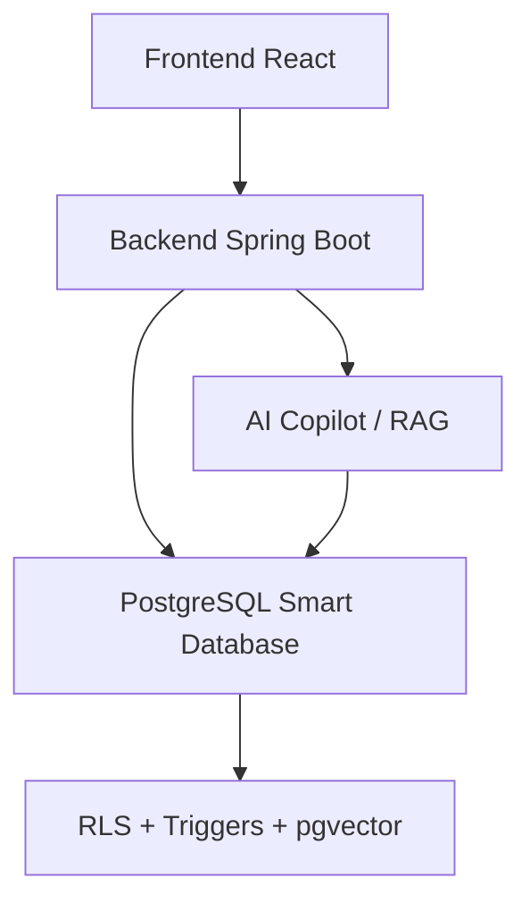
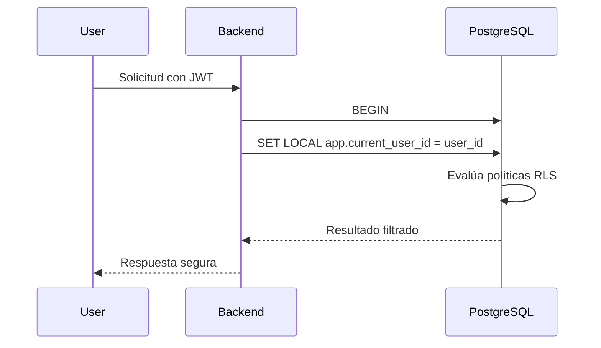

# Riwi Messaging Platform con AI Copilot

Una plataforma interna de mensajería empresarial con enfoque en seguridad, aislamiento multiusuario y asistencia IA contextual. El proyecto combina PostgreSQL 15+ con pgvector y RLS, un backend Spring Boot y un frontend React para ofrecer chat en tiempo real, canales, conversaciones y un copiloto con recuperación de contexto (RAG).

> Tecnologías principales: PostgreSQL 15+, pgvector, Spring Boot 3, Java 21, React 18, Tailwind CSS, Docker Compose.

---

## ¿Qué es este proyecto?

Este repositorio implementa una solución de comunicación interna para una empresa con varios equipos y niveles de acceso. La idea central es que la base de datos no solo almacene información, sino que también aplique reglas de negocio críticas:

- Control de acceso por canal y usuario
- Seguridad a nivel de filas con Row Level Security (RLS)
- Búsqueda full-text y semántica
- Mensajería en tiempo real
- Copilot que responde solo con datos autorizados
- Auditoría y trazabilidad de uso

La filosofía del proyecto es un enfoque de “Smart Database”: la lógica sensible y la seguridad se resuelven en PostgreSQL, mientras el backend actúa como orquestador ligero y el frontend ofrece la experiencia de usuario.

---

## Objetivos del sistema

- Facilitar la comunicación interna entre colaboradores por canales y conversaciones.
- Garantizar aislamiento de datos entre usuarios y equipos.
- Permitir acceso seguro a información privada solo a miembros autorizados.
- Añadir un asistente de IA que responda con contexto relevante y no rompa la privacidad.
- Mantener el sistema preparado para pruebas de seguridad, integración y despliegue con Docker.

---

## Arquitectura general

El sistema sigue una arquitectura de 3 capas con separación clara:

### 1. Frontend
- React 18 + Vite
- Diseño con 3 zonas principales:
  - conversaciones
  - chat principal
  - panel de Copilot
- Soporte para modo oscuro y claro
- Internacionalización ES / EN
- WebSockets para mensajes en tiempo real

### 2. Backend
- Spring Boot 3
- Java 21
- Seguridad JWT
- Endpoints REST y WebSocket
- Orquestación de lógica de negocio y acceso a la base de datos
- Integración con proveedor de IA y generación de embeddings

### 3. Base de datos
- PostgreSQL 15+
- pgvector para búsquedas semánticas
- RLS para filtrar filas por usuario autenticado
- Triggers y funciones para integridad, auditoría y seguridad
- Vistas, índices y procedimientos para mantener consistencia



---

## Características principales

### Seguridad y autorización
- Autenticación con JWT
- Refresh tokens con rotación
- Row Level Security en canales y mensajes
- Enfoque de mínimo privilegio para la conexión de la app
- Prevención de borrados físicos de mensajes
- Auditoría de uso del Copilot

### Mensajería
- Canales públicos y privados
- Mensajes con historial y paginación por keyset
- Lectura de mensajes y marcas de leído
- Comunicación en tiempo real mediante STOMP/WebSocket

### Copilot IA
- Recuperación por embeddings en PostgreSQL
- Filtrado de resultados según permisos del usuario
- Respuestas con citas de mensajes autorizados
- Prevención de fugas de información por contexto no autorizado

### Experiencia de usuario
- Panel de conversaciones
- Panel de copilot
- Perfil de usuario
- Toggle de tema
- Cambio de idioma

---

## Stack tecnológico

| Capa | Tecnología |
| --- | --- |
| Base de datos | PostgreSQL 15+ + pgvector + RLS |
| Backend | Spring Boot 3 + Java 21 |
| Frontend | React 18 + Vite + Tailwind CSS |
| Mensajería en tiempo real | STOMP / WebSocket |
| Seguridad | JWT, Spring Security |
| IA | OpenAI / Gemini-compatible provider + embeddings |
| Contenedores | Docker + Docker Compose |

---

## Requisitos previos

Para levantar el proyecto localmente necesitas:

- Docker Engine
- Docker Compose
- Git

Opcional para desarrollo local:

- Java 21
- Maven 3.8+
- Node.js 18+
- npm 9+
- psql

---

## Inicio rápido

### 1. Clonar el repositorio

```bash
git clone <url-del-repositorio>
cd prueba_desempeño
```

### 2. Configurar variables de entorno

Copia el ejemplo:

```bash
cp .env.example .env
```

El archivo `.env.example` ya incluye la configuración base para Docker y el proveedor de IA.

### 3. Levantar servicios con Docker

```bash
docker compose up -d --build
```

Esto levanta:

- Base de datos PostgreSQL
- Backend Spring Boot
- Frontend React

### 4. Verificar que todo esté funcionando

```bash
docker compose ps
```

URLs disponibles:

- Frontend: http://localhost:3000
- Backend: http://localhost:8080
- Swagger/OpenAPI: http://localhost:8080/swagger-ui.html
- WebSocket: ws://localhost:8080/ws

---

## Carga de datos iniciales

La base de datos se inicializa con migraciones automáticas y luego puedes cargar datos semilla para usuarios, canales y mensajes de prueba.

```bash
bash database/load-seed.sh
```

También puedes hacerlo manualmente con PostgreSQL si lo necesitas.

---

## Credenciales de prueba

El proyecto incluye usuarios predefinidos para validar permisos y aislamiento de datos.

| Nombre | Email | Contraseña | Rol | Acceso |
| --- | --- | --- | --- | --- |
| Carlos Mendoza | admin@riwi.io | RiwiAdmin2026! | admin | Acceso completo |
| Valeria Gomez | valeria.dev@riwi.io | RiwiDev2026! | member | Canales públicos y de desarrollo |
| Santiago Restrepo | santiago.coder@riwi.io | RiwiDev2026! | member | Restringido a canales no privados |
| Mariana Torres | mariana.ai@riwi.io | RiwiDev2026! | member | Restringida a canales autorizados |
| Alejandro Castro | alejandro.lead@riwi.io | RiwiDev2026! | admin | Acceso a liderazgo y administración |

Estas credenciales son útiles para comprobar:

- visibilidad y permisos por canal
- aislamiento de datos entre equipos
- comportamiento del Copilot bajo contexto restringido

---

## Flujo clave de seguridad

La pieza más importante del proyecto es la forma en que se valida el usuario en cada transacción:



Esto permite que el motor de base de datos decida si un usuario puede ver o no un mensaje, sin depender solo de la lógica de la aplicación.

---

## Pruebas automatizadas

El proyecto incluye pruebas enfocadas en seguridad, permisos y comportamiento funcional.

### Test de integración y RLS

```bash
bash tests/integration/test_runner.sh
```

### Test end-to-end de API

```bash
bash tests/e2e_api_test.sh
```

Estas pruebas validan escenarios como:

- aislamiento de miembros no autorizados
- privacidad de canales privados
- rotación de refresh tokens
- paginación clave
- búsquedas y contexto para Copilot
- borrado lógico y reactividad de seguridad

---

## Estructura del repositorio

```text
.
├── ARCHITECTURE.md
├── COPILOTO-MVP.md
├── README.md
├── docker-compose.yml
├── .env.example
├── credenciales_acceso.txt
├── database/
│   ├── migrations/
│   ├── seeds/
│   ├── load-seed.sh
│   ├── queries.sql
│   └── ER_MODEL.md
├── backend/
│   ├── Dockerfile
│   ├── pom.xml
│   └── src/
├── frontend/
│   ├── Dockerfile
│   ├── package.json
│   └── src/
├── spec/
│   └── ...
├── tests/
│   ├── integration/
│   ├── e2e_api_test.sh
│   └── ...
└── docs/
    └── ...
```

---

## Comandos útiles

### Levantar todo

```bash
docker compose up -d --build
```

### Reiniciar servicios

```bash
docker compose restart
```

### Ver logs

```bash
docker compose logs -f backend
```

```bash
docker compose logs -f frontend
```

### Parar contenedores

```bash
docker compose down
```

---

## Recomendación de uso

Para comprender bien el proyecto, se recomienda revisar el siguiente orden:

1. [README.md](README.md)
2. [ARCHITECTURE.md](ARCHITECTURE.md)
3. [spec/requirements.md](spec/requirements.md)
4. [database/ER_MODEL.md](database/ER_MODEL.md)
5. [COPILOTO-MVP.md](COPILOTO-MVP.md)

Así podrás entender primero el objetivo de negocio, después la arquitectura y finalmente los detalles técnicos.

---

## Licencia

Copyright © 2026 Riwi Co. S.A.S. Todos los derechos reservados.
