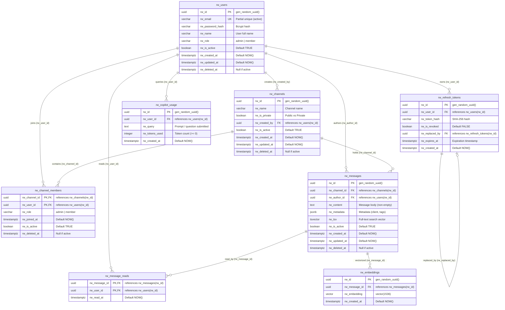

# Entity-Relationship (ER) Model Specification
**Riwi Co. S.A.S. — Internal Messaging Platform with AI**  
**PostgreSQL 15+ (pgcrypto, vector, pg_trgm)**  
**Paradigm:** Smart Database (Decisions D-01 through D-15)

---

## 1. Entity-Relationship (ER) Diagram

---

## 2. Table Specifications & Constraints

### 2.1 `rw_users`
Stores user identities, roles, and authentication credentials.

| Column | Type | Nullable | Default | Description | Constraints |
| :--- | :--- | :--- | :--- | :--- | :--- |
| `rw_id` | `UUID` | No | `gen_random_uuid()` | Primary Key | `PRIMARY KEY` |
| `rw_email` | `VARCHAR(255)` | No | - | User email | Partial Unique Index on active users |
| `rw_password_hash` | `VARCHAR(255)` | No | - | Bcrypt password hash | - |
| `rw_name` | `VARCHAR(100)` | No | - | Full name | - |
| `rw_role` | `VARCHAR(50)` | No | `'member'` | System role | `CHECK (rw_role IN ('admin', 'member'))` |
| `rw_is_active` | `BOOLEAN` | No | `TRUE` | Soft delete flag | `CHECK (rw_is_active = (rw_deleted_at IS NULL))` |
| `rw_created_at` | `TIMESTAMPTZ` | No | `NOW()` | Creation timestamp | - |
| `rw_updated_at` | `TIMESTAMPTZ` | No | `NOW()` | Last update timestamp | Managed by trigger |
| `rw_deleted_at` | `TIMESTAMPTZ` | Yes | `NULL` | Soft deletion timestamp | - |

---

### 2.2 `rw_channels`
Stores public and private communication channels.

| Column | Type | Nullable | Default | Description | Constraints |
| :--- | :--- | :--- | :--- | :--- | :--- |
| `rw_id` | `UUID` | No | `gen_random_uuid()` | Primary Key | `PRIMARY KEY` |
| `rw_name` | `VARCHAR(100)` | No | - | Channel name | - |
| `rw_is_private` | `BOOLEAN` | No | `FALSE` | Private channel flag | - |
| `rw_created_by` | `UUID` | No | - | Creator user reference | `REFERENCES rw_users(rw_id) ON DELETE RESTRICT` |
| `rw_is_active` | `BOOLEAN` | No | `TRUE` | Soft delete flag | `CHECK (rw_is_active = (rw_deleted_at IS NULL))` |
| `rw_created_at` | `TIMESTAMPTZ` | No | `NOW()` | Creation timestamp | - |
| `rw_updated_at` | `TIMESTAMPTZ` | No | `NOW()` | Last update timestamp | Managed by trigger |
| `rw_deleted_at` | `TIMESTAMPTZ` | Yes | `NULL` | Soft deletion timestamp | - |

---

### 2.3 `rw_channel_members`
Association table defining user memberships and channel-level admin roles.

| Column | Type | Nullable | Default | Description | Constraints |
| :--- | :--- | :--- | :--- | :--- | :--- |
| `rw_channel_id` | `UUID` | No | - | Channel reference | `REFERENCES rw_channels(rw_id) ON DELETE RESTRICT` |
| `rw_user_id` | `UUID` | No | - | User reference | `REFERENCES rw_users(rw_id) ON DELETE RESTRICT` |
| `rw_role` | `VARCHAR(50)` | No | `'member'` | Channel role | `CHECK (rw_role IN ('admin', 'member'))` |
| `rw_joined_at` | `TIMESTAMPTZ` | No | `NOW()` | Join timestamp | - |
| `rw_is_active` | `BOOLEAN` | No | `TRUE` | Active membership flag | `CHECK (rw_is_active = (rw_deleted_at IS NULL))` |
| `rw_deleted_at` | `TIMESTAMPTZ` | Yes | `NULL` | Soft deletion timestamp | - |
| **PK** | | | | `PRIMARY KEY (rw_channel_id, rw_user_id)` | |

---

### 2.4 `rw_messages`
Stores message content, metadata, and full-text search vectors.

| Column | Type | Nullable | Default | Description | Constraints |
| :--- | :--- | :--- | :--- | :--- | :--- |
| `rw_id` | `UUID` | No | `gen_random_uuid()` | Primary Key | `PRIMARY KEY` |
| `rw_channel_id` | `UUID` | No | - | Channel reference | `REFERENCES rw_channels(rw_id) ON DELETE RESTRICT` |
| `rw_author_id` | `UUID` | No | - | Author user reference | `REFERENCES rw_users(rw_id) ON DELETE RESTRICT` |
| `rw_content` | `TEXT` | No | - | Message text | `CHECK (TRIM(rw_content) <> '')` |
| `rw_metadata` | `JSONB` | No | `'{}'` | Extensible metadata | - |
| `rw_tsv` | `TSVECTOR` | Yes | `NULL` | Bilingual search vector | Maintained by trigger (`spanish` + `english`) |
| `rw_is_active` | `BOOLEAN` | No | `TRUE` | Soft delete flag | `CHECK (rw_is_active = (rw_deleted_at IS NULL))` |
| `rw_created_at` | `TIMESTAMPTZ` | No | `NOW()` | Creation timestamp | Indexed for Keyset pagination |
| `rw_updated_at` | `TIMESTAMPTZ` | No | `NOW()` | Last update timestamp | Managed by trigger |
| `rw_deleted_at` | `TIMESTAMPTZ` | Yes | `NULL` | Soft deletion timestamp | - |

---

### 2.5 `rw_message_reads`
Tracks read receipts per message per user (idempotent design).

| Column | Type | Nullable | Default | Description | Constraints |
| :--- | :--- | :--- | :--- | :--- | :--- |
| `rw_message_id` | `UUID` | No | - | Message reference | `REFERENCES rw_messages(rw_id) ON DELETE RESTRICT` |
| `rw_user_id` | `UUID` | No | - | User reference | `REFERENCES rw_users(rw_id) ON DELETE RESTRICT` |
| `rw_read_at` | `TIMESTAMPTZ` | No | `NOW()` | Read timestamp | - |
| **PK** | | | | `PRIMARY KEY (rw_message_id, rw_user_id)` | |

---

### 2.6 `rw_embeddings`
Stores 1536-dimensional vector embeddings for AI semantic search and RAG retrieval.

| Column | Type | Nullable | Default | Description | Constraints |
| :--- | :--- | :--- | :--- | :--- | :--- |
| `rw_id` | `UUID` | No | `gen_random_uuid()` | Primary Key | `PRIMARY KEY` |
| `rw_message_id` | `UUID` | No | - | Vectorized message ref | `REFERENCES rw_messages(rw_id) ON DELETE RESTRICT` |
| `rw_embedding` | `VECTOR(1536)` | No | - | pgvector embedding | 1536 dimensions |
| `rw_created_at` | `TIMESTAMPTZ` | No | `NOW()` | Creation timestamp | - |

---

### 2.7 `rw_refresh_tokens`
Stores SHA-256 hashed refresh tokens with rotation and revocation links.

| Column | Type | Nullable | Default | Description | Constraints |
| :--- | :--- | :--- | :--- | :--- | :--- |
| `rw_id` | `UUID` | No | `gen_random_uuid()` | Primary Key | `PRIMARY KEY` |
| `rw_user_id` | `UUID` | No | - | User reference | `REFERENCES rw_users(rw_id) ON DELETE RESTRICT` |
| `rw_token_hash` | `VARCHAR(255)` | No | - | SHA-256 hash | Indexed for O(1) lookup |
| `rw_is_revoked` | `BOOLEAN` | No | `FALSE` | Revocation status | - |
| `rw_replaced_by` | `UUID` | Yes | `NULL` | Successor token ref | `REFERENCES rw_refresh_tokens(rw_id) ON DELETE RESTRICT` |
| `rw_expires_at` | `TIMESTAMPTZ` | No | - | Expiration timestamp | - |
| `rw_created_at` | `TIMESTAMPTZ` | No | `NOW()` | Creation timestamp | - |
| **Constraint** | | | | `CHECK (rw_replaced_by IS NULL OR rw_replaced_by <> rw_id)` | |

---

### 2.8 `rw_copilot_usage`
Audits AI Copilot usage, queries, and token consumption per user.

| Column | Type | Nullable | Default | Description | Constraints |
| :--- | :--- | :--- | :--- | :--- | :--- |
| `rw_id` | `UUID` | No | `gen_random_uuid()` | Primary Key | `PRIMARY KEY` |
| `rw_user_id` | `UUID` | No | - | User reference | `REFERENCES rw_users(rw_id) ON DELETE RESTRICT` |
| `rw_query` | `TEXT` | No | - | Submitted prompt | - |
| `rw_tokens_used` | `INTEGER` | No | `0` | Consumed tokens | `CHECK (rw_tokens_used >= 0)` |
| `rw_created_at` | `TIMESTAMPTZ` | No | `NOW()` | Timestamp | - |

---

## 3. Database Views & Procedures

### 3.1 `rw_vw_user_conversations` (View)
Aggregates user channels, last message preview, author, timestamp, and accurate unread count calculated against `rw_message_reads`. Automatically filtered by channel-level Row Level Security.

### 3.2 Stored Procedures & Functions
- **`rw_fn_set_current_user(p_user_id UUID)`**: Sets transaction session context `app.current_user_id` for RLS.
- **`rw_fn_is_channel_member(p_channel_id UUID, p_user_id UUID)`**: `SECURITY DEFINER` function checking channel membership without infinite RLS recursion.
- **`rw_fn_is_channel_admin(p_channel_id UUID, p_user_id UUID)`**: `SECURITY DEFINER` function checking channel admin status.
- **`rw_fn_search_authorized_messages(p_candidate_ids UUID[])`**: Filters vector search candidate message IDs strictly through PostgreSQL RLS policies before passing text to the LLM.
- **`rw_sp_get_users(p_search TEXT, p_limit INT)`**: Procedural query for user listing with case-insensitive search.
- **`rw_sp_maintain_user(p_user_id UUID, p_name VARCHAR, p_role VARCHAR, p_action VARCHAR)`**: Centralized user update and soft delete procedure.
- **`rw_sp_create_user(p_email, p_password_hash, p_name, p_role)`**: `SECURITY DEFINER` user creation procedure.

---

## 4. Integrity Triggers

- **`trg_rw_*_set_updated_at`**: Automatically keeps `rw_updated_at = NOW()` on row modification.
- **`trg_rw_*_prevent_undeletion`**: Raises an exception if an attempt is made to restore a soft-deleted record (`rw_deleted_at IS NOT NULL -> NULL` or `rw_is_active = FALSE -> TRUE`).
- **`trg_rw_messages_tsv`**: Computes bilingual full-text search vector `to_tsvector('spanish', ...) || to_tsvector('english', ...)` on message write.

---

## 5. Security & Least Privilege

The application connects via the least-privileged database role **`rw_app`**:
- `NO DELETE` permissions are granted on any table (enforces soft deletes in database engine).
- Full `ROW LEVEL SECURITY` (RLS) active on all user data tables.
